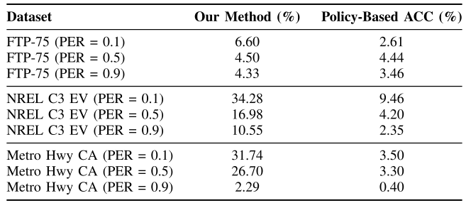
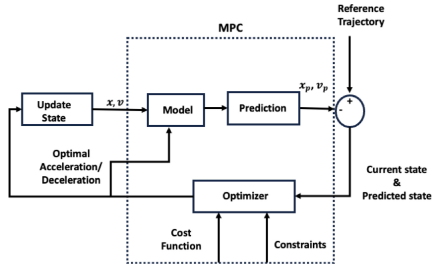
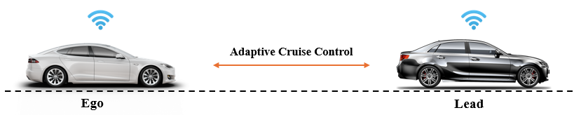
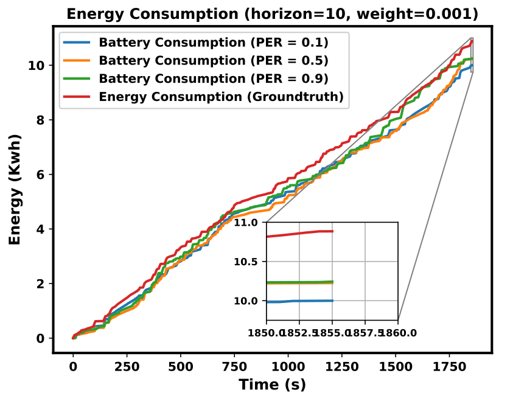
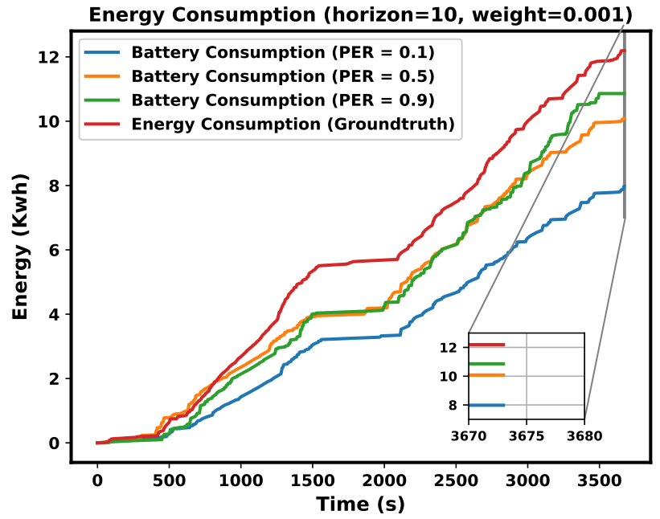
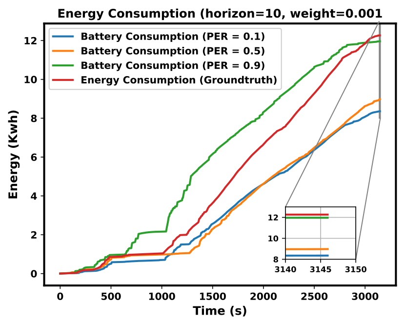

# Energy-Aware Autonomous Driving for Electric Vehicles  
### MPC + Deep Reinforcement Learning under Uncertainty

---

## Overview

This project presents an **end-to-end framework for energy-efficient autonomous driving in electric vehicles (EVs)**. It integrates **physics-based modeling, optimization, and learning-based control** to minimize energy consumption while maintaining safety and performance in adaptive cruise control (ACC) scenarios.

The system is designed to operate under **real-world constraints**, including:
- Communication packet loss (V2V)
- Uncertain or delayed preview information
- Non-convex energy consumption models
- Real-time control requirements

---

## Motivation

Energy efficiency is a critical challenge in EV autonomy. While traditional ACC systems ensure safety and comfort, they do not optimize for **battery energy usage**.

This project addresses:

- How to **optimize energy consumption** while following a lead vehicle  
- How to **handle uncertainty and unreliable communication**  
- How to bridge **model-based control (MPC)** and **learning-based control (DRL)**  

---

## System Architecture

The framework combines:

- **Electric Vehicle Energy Model**
  - Physics-based power loss model (function of speed and acceleration)
  - Includes mechanical, aerodynamic, and drivetrain losses

- **Control Layer**
  - Adaptive Cruise Control (ACC)
  - Model Predictive Control (MPC)
  - Deep Reinforcement Learning (SAC, TD3, DDPG)

- **Communication Layer**
  - Vehicle-to-Vehicle (V2V) information
  - Packet loss and noisy measurements

- **Optimization Objective**
  - Minimize energy consumption  
  - Maintain safe following distance  
  - Ensure smooth driving behavior

## Detailed Results

### FTP-75 Drive Cycle

### NREL C3 Dataset

### Metro Highway California

- Results show consistent energy reduction across datasets
- Performance varies with packet loss and prediction horizon
---

## Research Evolution

This repository unifies multiple stages of research into a single coherent framework.

### 🔹 Phase 1 — Forecast-Based Energy Optimization
- Introduced **speed preview (short horizon)**
- Applied smoothing to reduce aggressive acceleration
- Achieved measurable energy savings over baseline ACC

---

### 🔹 Phase 2 — Communication-Aware Optimization
- Modeled **packet loss and uncertainty in speed information**
- Introduced prediction strategies under missing data
- Evaluated robustness across multiple driving scenarios

---

### 🔹 Phase 3 — MPC with Adaptive Partitioning
- Modeled EV energy consumption as a **non-convex polynomial**
- Applied **adaptive partitioning** to locally approximate convex models
- Enabled **real-time MPC optimization**
- Achieved significant energy savings while maintaining safety and comfort

---

### 🔹 Phase 4 — Deep Reinforcement Learning
- Trained **off-policy RL algorithms (SAC, TD3, DDPG)**
- Learned control policies under uncertainty and communication loss
- Compared against MPC and classical baselines
- Explored trade-offs between energy efficiency and robustness

---

## Results

The framework demonstrates:

- Significant **energy reduction compared to baseline ACC**
- Robust performance under **high packet loss scenarios**
- Stable tracking of lead vehicle behavior
- Trade-offs between:
  - Energy efficiency
  - Safety
  - Comfort

### Example Outputs

---

## Repository Structure
